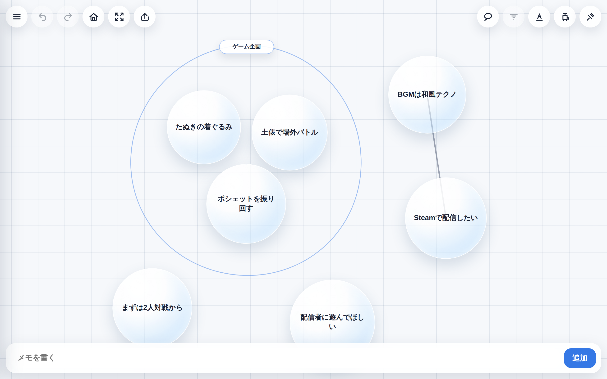
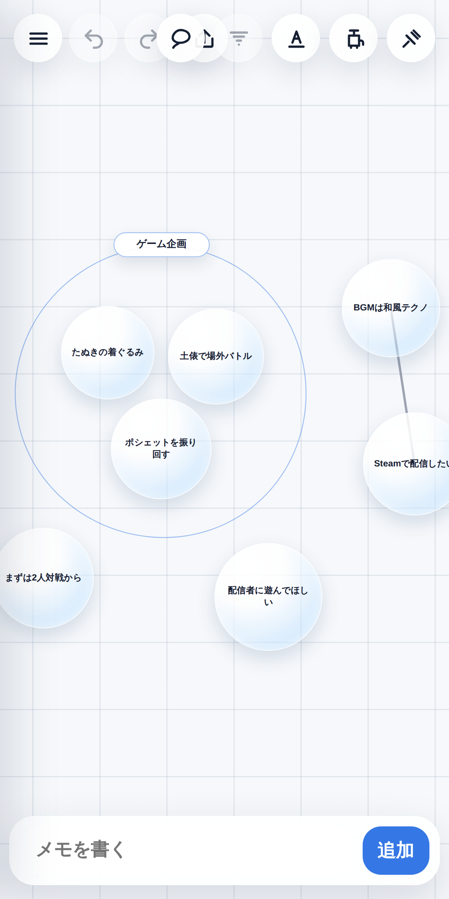

# BubbleMemo 🫧

**日本語は[こちら](#bubblememo--日本語)**

A playful, physics-driven memo app where your thoughts float as bubbles. Write an idea, watch it pop onto the board, and organize your thinking by dragging, grouping, inflating, and popping bubbles — all in a single HTML file that runs entirely in your browser.

> **Try it:** https://kitamuraproduction-bot.github.io/BubbleMemo_App/

## Features

- **Bubble memos** — Type a note and it appears as a floating bubble with soft, organic physics. Drag bubbles around freely; they gently push each other out of the way.
- **Groups (big bubbles)** — Drop bubbles into a big bubble to group related ideas. Groups auto-resize to fit their contents, can be nested, and can be renamed with a tap.
- **Pump & pin modes** — Long-press with the pump 🚲 to inflate a bubble (make an idea bigger!), or with the pin 📌 to shrink it. Tap with the pin to pop a bubble. Works on groups too: shrinking a group automatically repacks the bubbles inside.
- **Connections** — Link two bubbles and label the relationship between them.
- **Multiple boards** — Keep separate boards for separate projects, with selectable backgrounds (plain grid, world map, Japan map). The free version supports up to 5 boards.
- **One-tap sharing** — Tap "Send this board" and a share link is copied to your clipboard. The entire board is compressed and embedded in the URL itself — when someone opens it, an independent copy is imported onto *their* device. No accounts, no server, no collaborative editing surprises.
- **Undo / redo, lasso selection, alignment tools** — and other small conveniences for tidying up your thoughts.

## Privacy & data

BubbleMemo is a **completely serverless** web app:

- All boards are stored in your browser's `localStorage`. Nothing is uploaded anywhere.
- Share links carry the board data in the URL **fragment** (`#board=...`), which browsers do not send to any server.
- There is no tracking, no analytics, and no account system.

⚠️ **Note for iOS Safari users:** Safari may delete site data (including your boards) if you don't visit a site for 7 days. Adding BubbleMemo to your home screen exempts it from this cleanup and is the recommended way to use it.

## Running & deploying

BubbleMemo is a single `index.html` with zero dependencies and no build step.

- **Run locally:** just open `index.html` in a browser.
- **Deploy:** upload the file to any static host (GitHub Pages, Cloudflare Pages, Netlify, etc.). That's the entire deployment.

Because share links embed the full board data, links generated on one deployment URL will keep working as long as that URL stays alive — pick your final domain before sharing links widely.

## Tech notes

- Vanilla JavaScript, HTML, and CSS. No frameworks, no external libraries, no network requests.
- Custom soft-body-ish bubble physics with group packing and overlap resolution.
- Share links use `CompressionStream` (deflate) + base64url encoding, with an uncompressed fallback for older browsers.
- Custom in-app dialogs are used instead of `prompt()`/`confirm()` so the app also works inside WKWebView-based in-app browsers.

## Roadmap

- [ ] PWA manifest & offline install prompt
- [ ] Premium plan with unlimited boards
- [ ] More backgrounds and bubble themes

## License / Copyright

Copyright (c) 2026 kitamuraproduction. **All rights reserved.**

This repository is published for **viewing purposes only**. Unauthorized use, copying, modification, or redistribution of the source code — including publishing modified versions of this app — is **strictly prohibited** without the author's prior written permission.

---

# BubbleMemo 🫧 — 日本語

思いつきが「泡」になって浮かぶ、物理演算つきのメモアプリです。文字を打てばバブルがぽんと生まれ、ドラッグ・グループ化・膨らませ・割る、で考えを整理できます。HTML1ファイルだけで動き、すべてブラウザ内で完結します。

> **アプリはこちら:** https://kitamuraproduction-bot.github.io/BubbleMemo_App/

## 特徴

- **バブルメモ** — 入力したメモがふわふわ浮かぶバブルになります。ドラッグで自由に動かせて、バブル同士はやわらかく押し合います。
- **大バブル（グループ）** — バブルを大バブルに放り込んで、関連するアイデアをまとめられます。中身に合わせて自動で伸縮し、入れ子にもでき、タップで名前を変えられます。
- **空気入れと画鋲** — 空気入れ🚲で長押しするとバブルが膨らみ（アイデアを大きく育てる！）、画鋲📌で長押しすると縮みます。画鋲でタップすると割れます。大バブルにも使えて、縮めるときは中のバブルを自動で詰め直します。
- **つながり** — バブル同士を線でつないで、関係に名前を付けられます。
- **複数ボード** — プロジェクトごとにボードを分けられます。背景は通常グリッド・世界地図・日本地図から選択可能。無料版ではボードを最大5個まで作成できます。
- **ワンタップ共有** — 「このボードを送る」を押すと共有リンクがクリップボードにコピーされます。ボード全体を圧縮してURL自体に埋め込む方式なので、受け取った人が開くと**その人の端末に独立したコピー**として取り込まれます。アカウント不要・サーバー不要で、共同編集による事故も起きません。
- **アンドゥ/リドゥ、なげなわ選択、整列** — 考えを整えるための小さな便利機能もひと通り揃っています。

## プライバシーとデータ

BubbleMemoは**完全サーバーレス**のWebアプリです。

- すべてのボードはブラウザの`localStorage`に保存されます。どこにもアップロードされません。
- 共有リンクのデータはURLの**フラグメント**（`#board=...`）に載っており、ブラウザはこの部分をサーバーに送信しません。
- トラッキング・アクセス解析・アカウント機能は一切ありません。

⚠️ **iOS Safariをお使いの方へ:** Safariは7日間アクセスのないサイトのデータ（ボードを含む）を削除することがあります。ホーム画面に追加して使うとこの削除の対象外になるため、ホーム画面からの利用をおすすめします。

## 実行とデプロイ

BubbleMemoは依存ライブラリなし・ビルド不要の`index.html`1ファイルです。

- **ローカル実行:** `index.html`をブラウザで開くだけ。
- **デプロイ:** 静的ホスティング（GitHub Pages、Cloudflare Pages、Netlifyなど）にファイルを置くだけで公開完了です。

共有リンクにはボードのデータ全体が埋め込まれているため、公開URLが生きている限りリンクは有効です。リンクを広く配る前に、最終的なドメインを決めておくことをおすすめします。

## 技術メモ

- Vanilla JavaScript / HTML / CSSのみ。フレームワーク・外部ライブラリ・通信は一切なし。
- グループへの詰め込みと重なり解消を含む、自作のやわらかバブル物理。
- 共有リンクは`CompressionStream`（deflate）+ base64urlエンコード。非対応ブラウザ向けに無圧縮フォールバックあり。
- `prompt()`/`confirm()`の代わりに自前ダイアログを使用しているため、WKWebViewベースのアプリ内ブラウザでも動作します。

## ロードマップ

- [ ] PWAマニフェストとホーム画面追加の案内
- [ ] ボード無制限のプレミアムプラン
- [ ] 背景・バブルテーマの追加

## ライセンス / 著作権

Copyright (c) 2026 kitamuraproduction. **All rights reserved.**

本リポジトリは**閲覧のみを目的として**公開しています。作者の事前の許可なく、ソースコードの使用・複製・改変・再配布を禁止します。**本アプリを改変して公開・リリースする行為も禁止**です。
